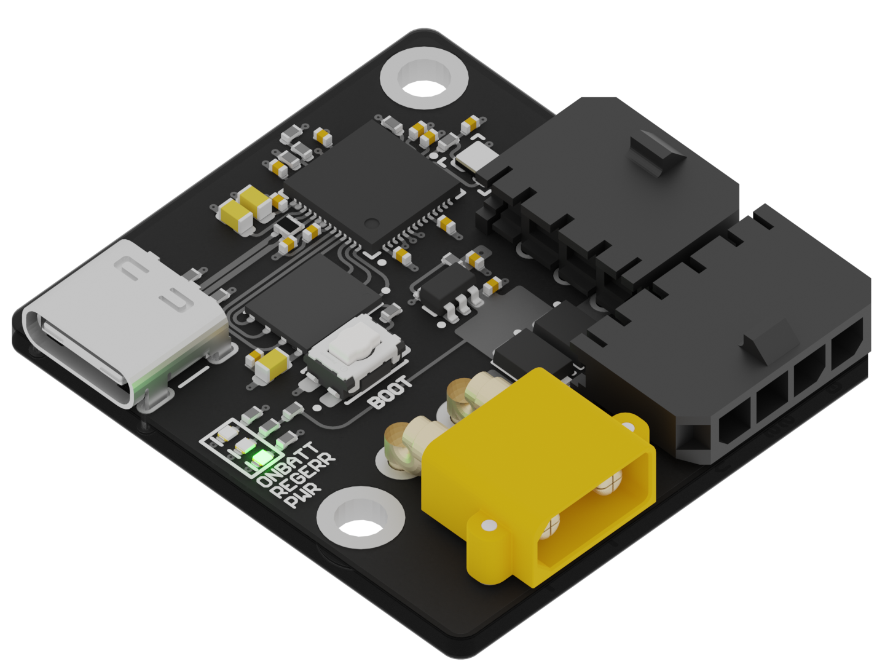

# Servo-Driver
A servo driver with battery backup to ensure failsafe.

# Features
- Programming and debug over USB or I2C
- Passively switches to battery when supply is interrupted
- Detects when on battery and positions servo at configured safe state
- Debug LEDs

# Ratings
## External Supply and Battery Voltage
These voltages are dependent on what servo is being driven, but these voltages should not only be very close to one another, but be within the range 5-12v.

# Current
Current should not exceed roughly 3 amps continous, probably can handle up to 8 amps burst (10 sec).

# Connectivity
## USB-C
Bootloader access and serial communication.

## XT30
Battery connection.

## Molex Micro-Fit
### 4-pin
- Power supply
- I2C
### 3-pin
- Servo signal and power

# Troubleshooting
## Debug LEDs
### Orange (ONBATT)
Indicates external supply is not present or insufficient and the backup battery is now supplying power.
This will also trigger moving the servo to the configured safe state.

### Red (REGERR)
Indicates the LDO regulator for the microcontroller is unable to maintain output (check battery or supply voltage).

### Green (PWR)
Directly connected to internal 3v3 rail. Basically the opposite of REGERR.

## WIP